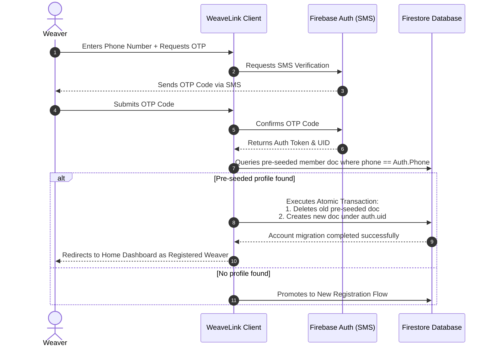
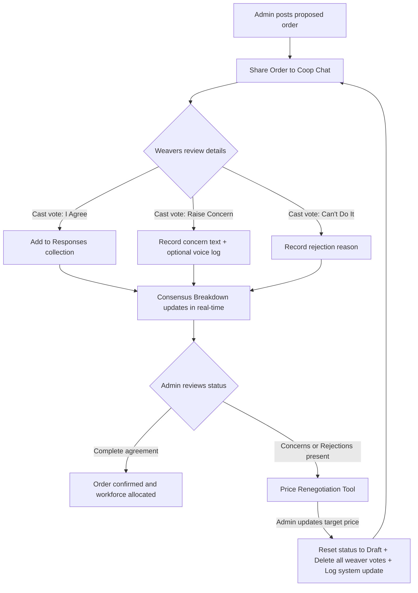
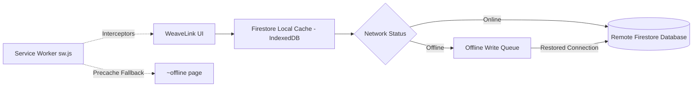

# 🧵 WeaveLink

[](https://nextjs.org)
[](https://react.dev)
[](https://firebase.google.com)
[](https://web.dev/progressive-web-apps/)
[](https://opensource.org/licenses/MIT)
[](https://weavelink-wheat.vercel.app/)

**A mobile-first Progressive Web App for handloom weaving cooperatives in India**

WeaveLink bridges the gap between traditional craftsmanship and modern cooperative commerce. The weaving itself stays exactly as skilled and manual as it's always been, but everything around the weaving — how an order gets accepted, how work gets split fairly, how a delay gets caught in time, and how payment gets divided — moves from informal, verbal coordination into a structured, transparent system that every member can see and trust. It is installable straight to a phone's home screen, works in English, Hindi, and Tamil, and is built around a simple principle: nothing that affects the whole cooperative should depend on one person remembering it correctly.

### 🔗 [Try the Live Demo →](https://weavelink-wheat.vercel.app/)

Use one of the test accounts below to sign in instantly, with no OTP required in demo mode:

| Role | Phone Number | Verification Code |
| :--- | :--- | :--- |
| **Admin** | `+919999999999` | `123456` |
| **Weaver** | `+918888888888` | `123456` |
| **Treasurer** | `+917777777777` | `123456` |

---

## 📖 Table of Contents
1. [Core Features](#-core-features)
2. [Order Lifecycle (End-to-End)](#-order-lifecycle-end-to-end)
3. [Workflow & Architecture Diagrams](#-workflow--architecture-diagrams)
4. [Technology Stack](#-technology-stack)
5. [Project Architecture](#-project-architecture)
6. [Local Installation & Setup](#-local-installation--setup)
7. [Database Seeding & Test Personas](#-database-seeding--test-personas)
8. [Security & Firestore Rules](#-security--firestore-rules)
9. [Design Philosophy & UX Design Tokens](#-design-philosophy--ux-design-tokens)
10. [Known Limitations & Tradeoffs](#-known-limitations--tradeoffs)

---

## 🎨 Core Features

1. **Multi-Role Dashboards**: Adaptive views for Admin (quote reviewing, pooling), Weaver (loom tracking, chat), and Treasurer (disbursements pool).
2. **Order → Consensus → Allocation → Production Pipeline**: A buyer's phone quote becomes a recorded order, the whole cooperative votes (Agree / Concern / Can't Do It), work is allocated recommended by capacity, and looms are tracked live.
3. **Direct Member Addition & Link**: Segmented form allowing Admins to add a brand-new member directly (fields: Name, Phone, Age, Experience, Specialization, Village/Area) or search and claim existing unassigned candidates.
4. **SMS Profile Self-Migration**: Transaction-safe profile self-migration. Newly registered weavers logging in with Phone Auth automatically claim their Admin-created profile document via telephone mapping in a single atomic database batch transaction.
5. **Group Chat Consensus & Structured Systems**: Live consensus polling inside the group chat (Agree, Concern, Cant-Do options) supporting voice note logging, live translation, and structured system logs (`member_added` events resolving dynamically in English, Hindi, and Tamil).
6. **Inter-Cooperative Material Pooling**: Cooperatives see each other's material needs on a map and pool bulk raw-material orders together to unlock better pricing.
7. **Mobile Responsive Precision**: Responsive reflowing layout cards, auto-collapsing bottom navbar for short screens/landscape orientation (< 540px), and truncated headings preventing layout overflows on narrow viewports (~360px).
8. **Real-time Production Tracking & Alerts**: Monitor loom progress, flag delays, and check transcribed voice progress logs.

---

## 🔄 Order Lifecycle (End-to-End)

WeaveLink turns the day-to-day running of a handloom cooperative into one connected, accountable system instead of a mix of phone calls, notebooks, and chat threads:

1. **Quote Logged**: A buyer quotes a price — the admin logs it the moment the call ends: buyer, item, quantity, price, deadline, so it's on record instead of in someone's memory.
2. **Cooperative Discussion**: The order is shared to the group chat, where the admin can add a plain-language summary or a voice note, in English, Hindi, or Tamil.
3. **Consensus Vote**: Instead of one person deciding for everyone, each weaver responds *Agree*, *Raise a Concern*, or *Can't Do It*, with their own reason attached, and a live consensus percentage builds in real time.
4. **Price Verification**: Once consensus is reached, the buyer confirms the order themselves on a public link, no account needed. From that point the price is frozen; changing it requires a formal renegotiation that resets the whole consensus vote.
5. **Work Allocation**: The system recommends how many units each weaver should take based on their current loom capacity and load, which the admin can fine-tune.
6. **Production Tracking**: Weavers log their own progress, and the cooperative sees a live rollup, so if someone falls behind, it's flagged immediately instead of discovered at the deadline.
7. **Payment Settled**: The treasurer sees every weaver's split and status; each weaver sees their own record. No single role controls price, consensus, and payment all at once.
8. **Materials Pooling**: Separate cooperatives can see each other's raw-material needs on a map and pool bulk orders, turning isolated groups into a network that negotiates better prices collectively.

---

## 📊 Workflow & Architecture Diagrams

### 1. SMS Profile Self-Migration Sequence
When cooperative admins pre-add a weaver, their profile document is temporarily stored as "unclaimed". Upon signing in using Phone Auth, the weaver dynamically links their credentials in a single atomic transaction:



### 2. Consensus & Price Renegotiation Flowchart
Proposed contracts must be collectively approved by cooperative weavers. If concerns or rejections arise, admins can renegotiate pricing, which resets the consensus cycle:



### 3. Offline Caching Architecture
Service worker file cache fallbacks coupled with Firestore IndexedDB persistence ensure uninterrupted offline operation:



---

## 🛠️ Technology Stack

| Layer | Technology | Badge / Link |
| :--- | :--- | :--- |
| **Framework** | Next.js 16 (App Router), React 19, TypeScript | `Next.js 16` |
| **Styling** | Vanilla CSS customized design tokens + Tailwind CSS utilities | `CSS & Tailwind` |
| **Icons & Fonts** | Outfit, IBM Plex Sans, Material Symbols Outlined | `Google Fonts` |
| **Database & Auth** | Firebase Firestore (IndexedDB offline cache) + Firebase Auth (Phone OTP) | `Firebase Suite` |
| **PWA Engine** | `@ducanh2912/next-pwa` compiled via Webpack configurations | `next-pwa` |
| **Localization** | Multi-language support (English/Hindi/Tamil) via `next-intl` | `next-intl` |
| **Charts** | Recharts (for District Price Benchmarking) | `Recharts` |

---

## 📂 Project Architecture
```
weavelink/
├── messages/          # next-intl translation dictionaries (en, hi, ta JSON)
├── public/            # Static assets, PWA manifest, service worker assets
├── scripts/           # Firebase Admin DB seeding scripts
├── src/
│   ├── app/           # Next.js App Router folders
│   │   ├── [locale]/  # Localized routes structure
│   │   └── ~offline/  # Precached PWA offline fallback route
│   ├── components/    # Reusable UI widgets (Header, Navbar, DevBar)
│   ├── context/       # Authentication & profile state manager
│   ├── hooks/         # Client hooks (usePWA)
│   ├── i18n/          # next-intl configuration
│   ├── lib/           # Firebase SDK initialization & utility tokens
│   └── proxy.ts       # next-intl path matcher rules
└── firestore.rules    # Declarative role-based database security configurations
```

---

## 🚀 Local Installation & Setup

### 1. Prerequisites
* Node.js v18 or later
* Firebase Project

### 2. Setup Config
Clone the project and install dependencies:
```bash
git clone https://github.com/Sanjay567-coder/weavelink.git
cd weavelink
npm install
```

Create a `.env.local` file in the root directory:
```env
NEXT_PUBLIC_FIREBASE_API_KEY=your-api-key
NEXT_PUBLIC_FIREBASE_AUTH_DOMAIN=your-auth-domain
NEXT_PUBLIC_FIREBASE_PROJECT_ID=your-project-id
NEXT_PUBLIC_FIREBASE_STORAGE_BUCKET=your-storage-bucket
NEXT_PUBLIC_FIREBASE_MESSAGING_SENDER_ID=your-sender-id
NEXT_PUBLIC_FIREBASE_APP_ID=your-app-id

# Firebase Admin credentials (used for database seeding)
FIREBASE_CLIENT_EMAIL=your-firebase-client-email
FIREBASE_PRIVATE_KEY="your-firebase-private-key"
```

### 3. Build & Run Commands
* **Run local development server**: `npm run dev`
* **Compile and build production bundle**: `npm run build` (compiled with `--webpack` flags to generate PWA assets)
* **Start production build server**: `npm run start`

---

## 👥 Database Seeding & Test Personas
To seed your Firestore database with test cooperatives, weaver accounts, pending consensus orders, and payment ledgers, run the database seeding script:
```bash
npm run seed
```

### Verification & Test Phone Numbers
The seeding script registers specific test accounts in Auth. To test the real Phone Auth sign-in path without SMS costs, add these test numbers in your **Firebase Console > Authentication > Sign-in method > Phone > Phone numbers for testing**:

| Role | Test Phone Number | Verification Code |
| :--- | :--- | :--- |
| **Admin** | `+919999999999` | `123456` |
| **Weaver** | `+918888888888` | `123456` |
| **Treasurer** | `+917777777777` | `123456` |

---

## 🔒 Security & Firestore Rules
WeaveLink enforces strict, document-level security rules matching our three-way role separation model. You can deploy these rules directly using `firebase-tools`:

* **Cooperatives**: Global read access for authenticated members; write access restricted strictly to the cooperative's Admin.
* **Members**: Read access allowed if the member belongs to the same cooperative or is unassigned. Create/update rules restrict Admins to writing only weaver roles inside their own cooperative ID, and allow weavers to write their own profiles during self-linking migration.
* **Orders**: Authenticated members can list orders. Creation and update rights belong to the cooperative Admin. Once an order status is marked as `'confirmed'`, price changes are rejected.
* **Public Buyer Portal**: Unauthenticated buyers are granted `update` access on orders, restricted strictly to `buyerConfirmed` and `buyerConfirmedAt` fields, and only if `buyerConfirmed` is not already `true`.
* **Pooling Requests**: Read/write access is restricted exclusively to Admins of the participating cooperatives.

---

## 🎨 Design Philosophy & UX Design Tokens
WeaveLink is built with a custom **Artisanal Digital Cooperative** design system designed to reflect raw handloom craft materials:
* **Background Color**: `#faf9f5` (warm, natural cotton color).
* **Primary / Accent Color**: `#9b2f00` (terracotta, earth-clay tone).
* **Typography**: **Outfit** for clean headings, and **IBM Plex Sans** for highly legible, localized Tamil and Hindi texts.
* **Micro-interactions**: Subtle hover scales, active button contractions, and pulsing consensus badges.

---

## ⚠️ Known Limitations & Tradeoffs
1. **Seeded Order Hardcoding**: To guarantee demo consistency for judges on stage, Weaver progress logging and Treasurer payout cards link directly to the seeded active batch `order-4421` on the Home screen.
2. **Double-Claim Race Condition**: If two Admins from different cooperatives try to claim the same unassigned candidate at the same time, last-write-wins rules apply, and no error is thrown.
3. **Web Speech API limitations**: Speech recognition is handled by the browser. Google Chrome is recommended for the best experience.
